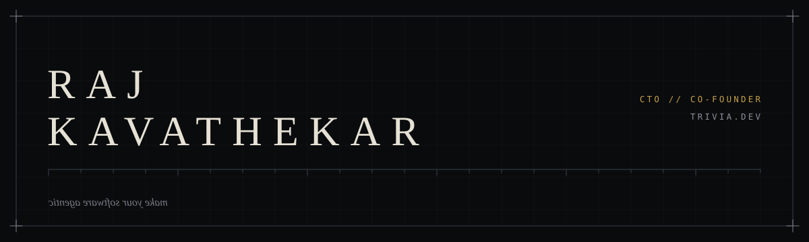

## ▚ &nbsp;BUILDING

An agentic layer for software that already exists. Index a product's API surface and components; turn a plain-language prompt into a working mini-app *inside* that product.

```yaml
product:   trivia.dev
role:      CTO // co-founder
surface:   indexes a product's API endpoints + components
output:    plain-language prompt -> working mini-app, in-product
guardrail: user's own permissions, explicit approval before writes
```

---

## ▚ &nbsp;RESEARCH

**Per-turn context-aware toxicity detection.** Classifiers read a chat message as context-free text. It isn't — the same string means one thing after a death and another after a comeback.

```yaml
unit:     per turn — each utterance scored against the game state
          at that moment, not against the match as a whole
context:  deaths, win/loss, per-player performance
method:   condition transformers on per-turn state features
contrib:  method + dataset
data:     ToxBuster, CONDA
status:   ongoing
```

---

## ▚ &nbsp;PRIOR

```ini
[EasyChamp]                AI Engineer
task                       soccer action classification
model                      spatiotemporal CNN
accuracy                   80.5% CV / 87% test
pipeline                   PyTorch, RF-DETR, SAM, ONNX

[Northeastern]             MS Computer Science
```

---

```ini
linkedin   linkedin.com/in/raj-kavathekar
mail       rajkavathekar25@gmail.com
```
